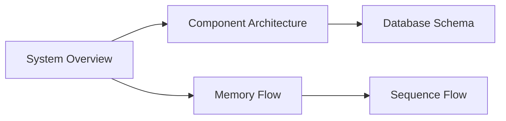
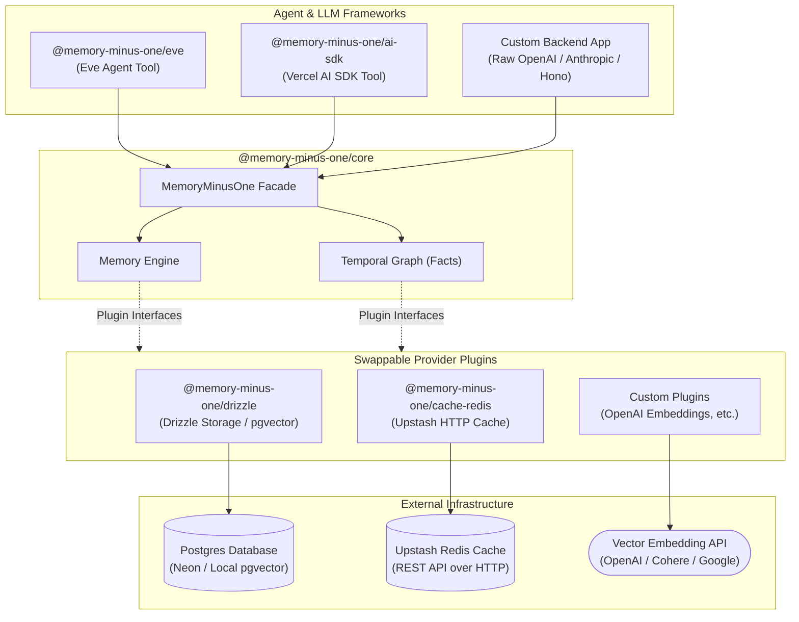
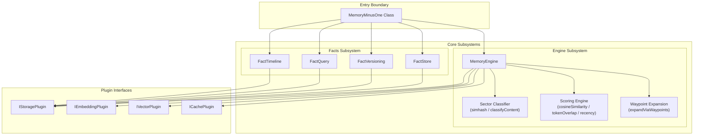
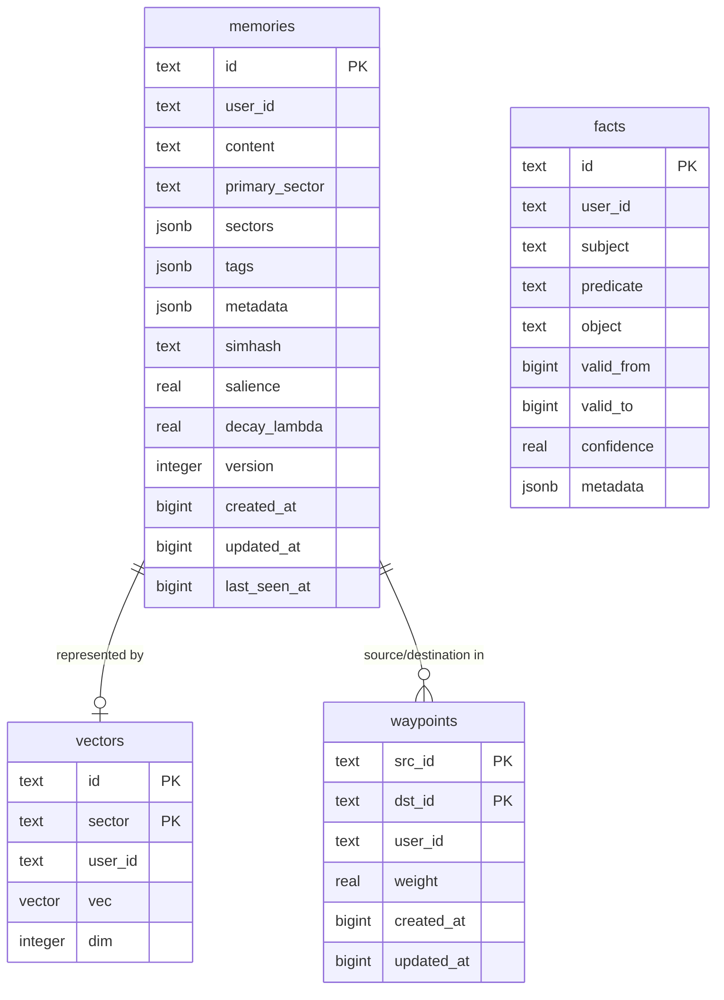
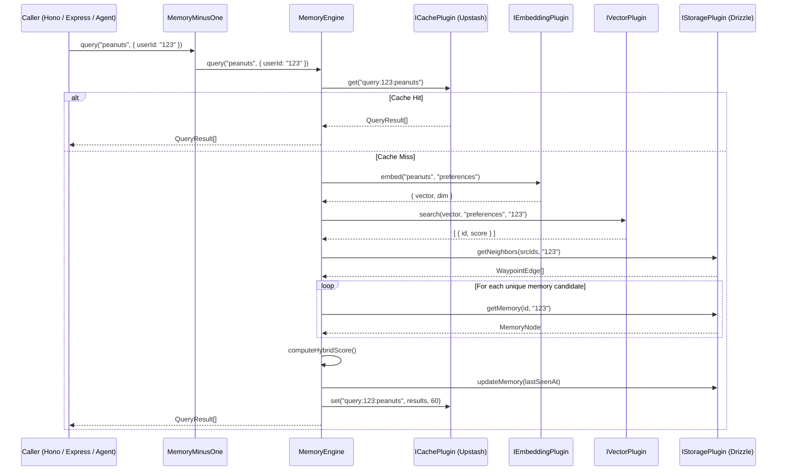

# MemoryMinusOne

## Navigation



<!-- diagram:overview:system -->
## System Overview



<!-- diagram:component:architecture -->
## Component Architecture



<!-- diagram:dataflow:memory -->
## Memory Flow

```mermaid
flowchart LR
    subgraph AddFlow ["add(content) Flow"]
        direction LR
        InAdd([Memory Content]) --> Classify[Classify Sector]
        Classify --> EmbedAdd[Generate Embedding]
        EmbedAdd --> VectorStore[Store Vector]
        EmbedAdd --> DBStore[Insert Memory Node]
    end

    subgraph QueryFlow ["query(queryText) Flow"]
        direction LR
        InQuery([Query String]) --> CacheCheck{Check Cache}
        CacheCheck -->|Hit| OutCached([Cached QueryResult[]])
        
        CacheCheck -->|Miss| EmbedQuery[Generate Embedding]
        EmbedQuery --> VectorSearch[Vector Search Hits]
        VectorSearch --> GraphExpand[Expand Waypoints]
        GraphExpand --> Rescore[Compute Hybrid Scores]
        Rescore --> Sort[Sort & Slice]
        Sort --> SaveCache[Write to Cache]
        SaveCache --> OutQuery([QueryResult[]])
    end
```

<!-- diagram:er:database -->
## Database Schema



<!-- diagram:sequence:query -->
## Sequence Flow


