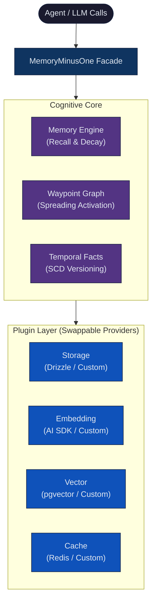

<p align="center">
  <h1 align="center">MemoryMinusOne</h1>
  <p align="center">
    <strong>Plugin-first, embeddable long-term memory for AI agents.</strong>
  </p>
  <p align="center">
    <a href="#quickstart">Quickstart</a> · <a href="#architecture">Architecture</a> · <a href="#packages">Packages</a> · <a href="#api">API</a> · <a href="#plugins">Plugins</a>
  </p>
</p>

---

MemoryMinusOne is a TypeScript SDK that gives your AI agents persistent, long-term memory. It embeds directly into your existing app (Express, Next.js, Nuxt, Hono — anything Node.js) and handles the hard parts: semantic search, temporal fact tracking, memory decay, and waypoint graphs.

**Zero vendor lock-in.** Every capability — storage, embeddings, vector search, cache — is a swappable plugin.

## Features

- 🔌 **Plugin-first** — Swap storage, embeddings, vector, and cache without changing app code
- 🧠 **Hybrid recall** — Vector similarity + waypoint graph traversal + token overlap + recency scoring
- 📅 **Temporal facts** — Track facts over time with automatic versioning (e.g. "lives in Mumbai" → "lives in Bangalore")
- 🔒 **User isolation** — Every query is scoped by `userId`. Zero data leakage between tenants.
- ⚡ **Serverless-ready** — HTTP-based plugins (Upstash Redis, Neon Postgres) work on Cloudflare Workers, Vercel Edge, AWS Lambda
- 🛠️ **LLM tool-ready** — Drop-in tool definitions for Vercel AI SDK, Eve, or raw OpenAI function calling

## Quickstart

```bash
pnpm add @memory-minus-one/core
```

```typescript
import { createMemory, memoryStorage, syntheticEmbedding, memoryVectorStore } from "@memory-minus-one/core";

const mem = createMemory({
  storage: memoryStorage(),        // in-memory (swap for Drizzle in prod)
  embedding: syntheticEmbedding(), // TF-IDF (swap for OpenAI/Cohere in prod)
  vector: memoryVectorStore(),     // brute-force cosine (swap for pgvector in prod)
});

await mem.init();

// Store
await mem.add("User is allergic to peanuts", { userId: "user_123" });

// Recall
const results = await mem.query("food allergies", { userId: "user_123" });
// → [{ memory: { content: "User is allergic to peanuts", ... }, score: 0.92 }]

// Retrieve
const memory = await mem.get(results[0].memory.id, { userId: "user_123" });

// Reinforce (prevents decay)
await mem.reinforce(results[0].memory.id, { userId: "user_123" });
```

## Production Setup

For production, swap the in-memory plugins for real backends:

```typescript
import { createMemory } from "@memory-minus-one/core";
import { drizzleStorage, drizzlePgVector } from "@memory-minus-one/drizzle";
import { aiSdkEmbedding } from "@memory-minus-one/ai-sdk";
import { upstashCache } from "@memory-minus-one/cache-redis";
import { drizzle } from "drizzle-orm/neon-http";

const db = drizzle(process.env.DATABASE_URL!);

const mem = createMemory({
  storage: drizzleStorage({ db }),
  embedding: aiSdkEmbedding({ model: openai.embedding("text-embedding-3-small") }),
  vector: drizzlePgVector({ db }),
  cache: upstashCache({
    url: process.env.UPSTASH_REDIS_REST_URL!,
    token: process.env.UPSTASH_REDIS_REST_TOKEN!,
  }),
});
```

## Architecture




## Packages

| Package | Description | Install |
|---|---|---|
| `@memory-minus-one/core` | Engine, plugin system, built-in in-memory plugins | `pnpm add @memory-minus-one/core` |
| `@memory-minus-one/drizzle` | Drizzle ORM storage + pgvector plugin | `pnpm add @memory-minus-one/drizzle` |
| `@memory-minus-one/ai-sdk` | Vercel AI SDK embedding plugin + LLM tools | `pnpm add @memory-minus-one/ai-sdk` |
| `@memory-minus-one/cache-redis` | Upstash Redis cache (serverless-safe, HTTP) | `pnpm add @memory-minus-one/cache-redis` |
| `@memory-minus-one/eve` | Eve agent framework tool wrapper | `pnpm add @memory-minus-one/eve` |

## API

### Core Operations

```typescript
// Store a memory
await mem.add(content, { userId, metadata?, tags? })

// Semantic search
await mem.query(queryText, { userId, sector?, limit? })

// Get by ID
await mem.get(id, { userId })

// List by sector
await mem.getAll(sector, { userId, limit? })

// Reinforce (bump salience, prevent decay)
await mem.reinforce(id, { userId })
```

### Temporal Facts

```typescript
// Track evolving facts
await mem.facts.evolve("user", "lives_in", "Mumbai", { userId })
await mem.facts.evolve("user", "lives_in", "Bangalore", { userId })

// Query current state
await mem.facts.query.active("user", "lives_in", userId)
// → { subject: "user", predicate: "lives_in", object: "Bangalore" }

// Full timeline
await mem.facts.timeline("user", userId)
// → [{ object: "Mumbai", validFrom: ..., validTo: ... }, { object: "Bangalore", validFrom: ..., validTo: null }]

// Point-in-time queries
await mem.facts.query.at(Date.now() - 86400000, userId) // yesterday's facts
```

## Plugins

Every plugin implements a simple interface. Write your own in ~10 lines:

```typescript
import { ICachePlugin } from "@memory-minus-one/core";

export function myCustomCache(): ICachePlugin {
  return {
    name: "my-cache",
    version: "1.0.0",
    async get(key) { /* ... */ },
    async set(key, value, ttl) { /* ... */ },
    async delete(key) { /* ... */ },
  };
}
```

### Plugin Interfaces

| Interface | Methods |
|---|---|
| `IStoragePlugin` | `insertMemory`, `updateMemory`, `getMemory`, `getMemoriesBySector`, `deleteMemory`, `insertWaypoint`, `getNeighbors`, `pruneWaypoints`, `insertFact`, `updateFact`, `getActiveFact`, `queryFacts`, `invalidateFact` |
| `IEmbeddingPlugin` | `embed`, `embedBatch` |
| `IVectorPlugin` | `storeVector`, `search`, `deleteVector` |
| `ICachePlugin` | `get`, `set`, `delete` |

## Using with LLMs

### Vercel AI SDK

```typescript
import { memoryTool } from "@memory-minus-one/ai-sdk";

const result = await generateText({
  model: openai("gpt-4o"),
  tools: { memory: memoryTool(mem) },
  messages,
});
```

### Raw OpenAI / Any Provider

```typescript
// Define a tool schema, then switch on the action:
switch (args.action) {
  case "add":    await mem.add(args.content, { userId }); break;
  case "query":  await mem.query(args.content, { userId }); break;
  case "get":    await mem.get(args.content, { userId }); break;
  case "reinforce": await mem.reinforce(args.content, { userId }); break;
}
```

## License

Apache 2.0
